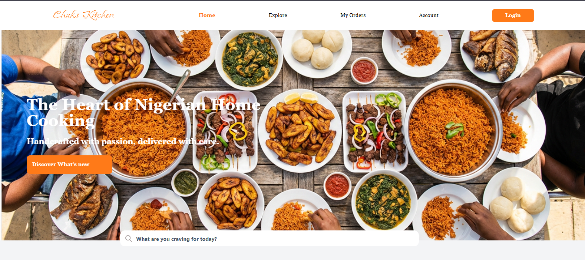
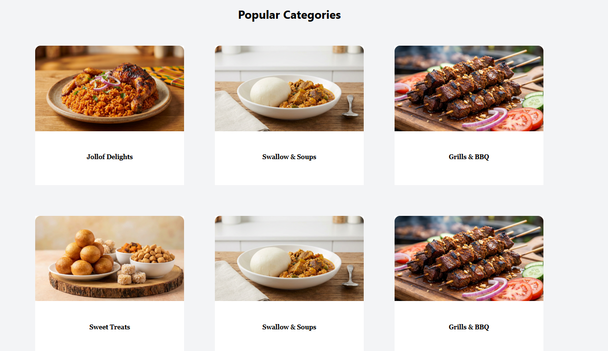
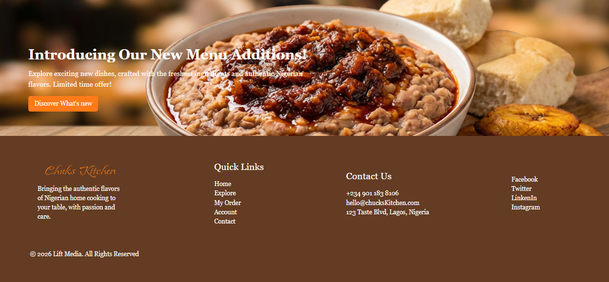
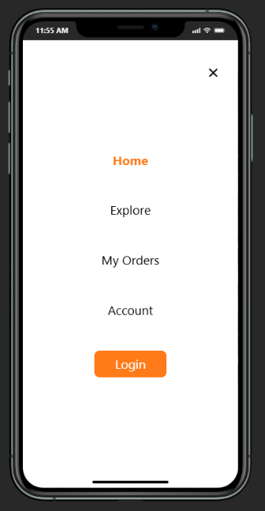
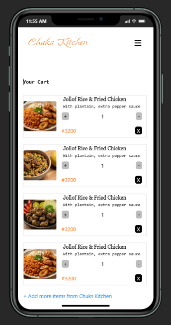

[Live Demo](https://food-app-intern.vercel.app/)
# 🍽️ Chuks Kitchen – React Food Ordering Web App

## Chuks Kitchen is a modern React-based food ordering web application that allows users to browse delicious Nigerian meals, add items to cart, and complete checkout with order confirmation.

## 🚀 Features

- User Sign Up & Login
- Browse Food Categories
- View Popular & Chef’s Special Delicacies
- Add / Remove / Modify Cart Items
- Checkout System
- Order Confirmation Page
- Responsive Design (Mobile & Desktop)
- Client-side Routing using React Router

---

## 🧭 Application Workflow

The application follows this user journey:

1. **View Homepage**
2. **Browse Menu**
3. **Select Food Item**
4. **Add to Cart**
5. **Review Cart**

---

## 🛠️ Tech Stack

- React
- React Router
- Tailwind CSS
- JavaScript (ES6+)

---

## 📂 Project Structure

```
FOOD-ORDERING-APP
│
├── node_modules/
│
├── public/      # Static assets (images, icons, svg files)
│
├── src/
│   ├── components/    # Reusable UI components
│   ├── data/       # JSON data files (foods,categories, specials)
│   ├── layout/  # Layout wrappers (Navbar, Footer, MainLayout)
│   ├── pages/   # Application pages (routes)
│   │
│   ├── App.jsx   # Route configuration
│   ├── index.css   # Global styles
│   └── main.jsx    # React entry point
│
├── .gitignore
├── bun.lock
├── eslint.config.js
├── index.html
├── package.json
├── README.md
├── tailwind.config.js
├── vercel.json
└── vite.config.js
```

---

## 🧭 Routing Structure (React Router)

Navigation is handled using React Router and includes:

| Route       | Page     |
| ----------- | -------- |
| `/`         | Home     |
| `/explore`  | Explore  |
| `/my-order` | My Order |
| `/account`  | Account  |
| `/login`    | Login    |

---

## 📸 Screenshot






--

## ⚙️ Installation & Setup

#### Clone the repository

```
git clone https://github.com/Horlanrewajucode/Food-App.git
```

#### Navigate into the project

```
cd FOOD-ORDERING-APP
```

#### Install dependencies

```
bun install
```

#### Start development server

```
bun run dev
```
----
## 📦 Build for Production
````
bun run build
````

## 🌍 Deployment

The project is configured for deployment on:

- Vercel (via vercel.json)

- Any static hosting platform that supports Vite builds
----
## 👨‍💻 Author

Built with React and Tailwind CSS 💖